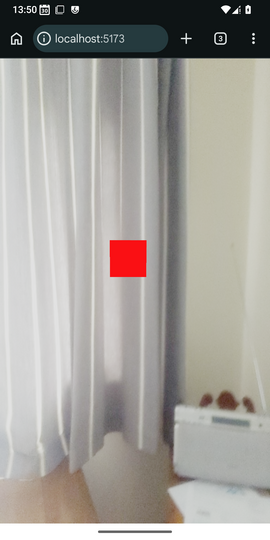

# RDK location-based tutorial - Part 1 - Hello World!

In part 1 we will cover the absolute basics of an RDK app by creating the "Hello World" of location-based augmented reality: a red cube positioned at a specific latitude and longitude. The tutorial will use TypeScript, and Vite as a development server and bundler. You should have some basic knowledge of TypeScript and React as well as [three.js](https://threejs.org), including, for example, familiarity with the concept of meshes, geometries and materials.

## Setting up the project

The first thing you will need to do is create a project with the appropriate dependencies. You can use an IDE, such as VS Code, or pure command line. On the console, install the dependencies with `npm`:

```console
npm i @ar-js-org/ar.js @omnidotdev/rdk @react-three/fiber @react-three/xr locar react react-dom 
```

```console
npm i -D @vitejs/plugin-react vite @types/react @types/react-dom @types/three typescript
```

### Adding npm scripts

Add a `dev` script to your `package.json`:

```json
"scripts": {
    "dev" : "vite dev",
}
```

### Configuring TypeScript

Certain TypeScript configuration settings need to be used to successfully compile and run an RDK project. Use a setup such as the following for your `tsconfig.json`:

```json
{
    "compilerOptions": {
        "noEmit" : true,
        "strict" : true,
        "target" : "esnext",
        "moduleResolution" : "bundler",
        "module" : "preserve",
        "skipLibCheck" : true,
        "jsx" : "preserve"
    },
    "files" : [ "src/main.tsx" ]
}
```

Also create a `vite.config.mjs` enabling the Vite React plugin:

```javascript
import { defineConfig } from 'vite';
import react from '@vitejs/plugin-react';

export default defineConfig({
    plugins: [react()]
});
```

We are now setup, and can begin development!

## Coding the Hello World app

We can now create our Hello World app! Firstly, an HTML template for the app to be rendered into:

```html
<!DOCTYPE html>
<html>
<head>
<script type='module' src='src/main.tsx'></script>
<title>RDK Hello World</title>
<style type='text/css'>
html, body {
    width: 100%;
    height: 100%;
    margin: 0;
    padding: 0;
    overflow: hidden;
}

#root {
   width: 100%;
   height: 100%
}
</style>
</head>
<body>
<div id='root'></div>
</body>
</html>
```

then, in your `src` directory, the standard React startup code to create a root node and render some JSX into it (save as `main.tsx`):

```tsx
import { createRoot } from 'react-dom/client';
import App from './components/App';

const root = createRoot(
    document.getElementById("root")!
);
root.render(<App />);
```

Now, the actual `App` component, making use of RDK. Save as `App.tsx` inside the `components` subdirectory within `src`:

```tsx
import { Canvas } from '@react-three/fiber';
import { GeolocationAnchor, GeolocationSession, XR } from '@omnidotdev/rdk';

export default function App() {
    return(
        <Canvas gl={{antialias: false, powerPreference: "default"}}>
            <XR>
                <GeolocationSession options={{ fakeLat : 51.05, fakeLon : -0.72 }}>
                    <GeolocationAnchor latitude={51.0505} longitude={-0.72}>
                        <mesh>
                            <boxGeometry args={[10, 10, 10]} />
                            <meshBasicMaterial color="red" />
                        </mesh>
                    </GeolocationAnchor>
                </GeolocationSession>
            </XR>
        </Canvas>
    );
}
```

Much of this code is from [React Three Fiber](https://r3f.docs.pmnd.rs) - a library which provides a React interface to three.js, allowing you to represent 3D objects as React components. In particular, `Canvas`, `mesh`, `boxGeometry` and `meshBasicMaterial` are all from React Three Fiber. 

The specific RDK components are `XR`, `GeolocationSession` and `GeolocationAnchor`. `XR` represents an eXtended reality session: RDK can also perform other types of augmented reality such as marker-based. Within our `XR` session, we create a specific `GeolocationSession` allowing us to use location-based AR. Because you might be testing this indoors, we specify a *fake* latitude and longitude to use. If the `fakeLat` and `fakeLon` options are omitted, RDK will attempt to obtain the device's real GPS location.

Within the `GeolocationSession` we then setup a `GeolocationAnchor`. A `GeolocationAnchor` represents a single point object within the world, such as a point of interest. Note how we specify its latitude and longitude.

Within the `GeolocationAnchor` we then specify whatever mesh, or group of meshes, we wish to use to render our point of interest. Here we return to React Three Fiber and setup a `mesh` containing a box geometry and red basic material (basic materials are uninfluenced by lighting - in a real app you might want to setup lights and use a `meshStandardMaterial` instead but more of that later). In other words, a red box will appear, 0.0005 degrees north of our position.

### Run it!

We are using Vite as a development server. To run it, run the apprpriate script:

```console
npm run dev
```

You will then be able to access your AR Hello World app on `http://localhost:5173`. You should see a red box in front of you. On a desktop or laptop this will be static in the middle of the screen, but on a mobile device it should only be visible if you point the device north.

Here is a screenshot on a real device, facing north:



Now go on to [Part 2](part2.md).
