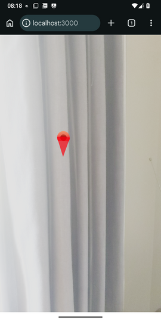

# RDK location-based tutorial - Part 2 - Connecting to a server

In Part 2 we will start to make our app a bit more useful by connecting to a server and retrieving some hard-coded POIs from an API. For now, these will not be stored in a database, but we will come back to that in Part 3.

We will use [Express](https://expressjs.com) as it is one of the most long-standing server frameworks for Node.js and familiar to many. We will use it together with Vite allowing us to take advantage of Vite's development server: we can do this with [vite-express](https://github.com/szymmis/vite-express).


## Setting up the project

We will need to install extra dependencies, namely `express`, `@types/express` and `vite-express` as well as `tsx` : an extension to Node.js to directly execute TypeScript, which we'll neeed to run our server.

```console
npm i express vite-express tsx
npm i -D @types/express
```


### Adding npm scripts

You should modify your `npm` scripts to run `server.ts`, which will be a `vite-express` server:
```json
"scripts": {
    "dev" : "tsc && tsx server.ts",
}
```

### Configuring TypeScript

Ensure you add `server.ts` to the list of files to be type-checked:

```json
{
    "files" : [ "server.ts", "src/main.tsx" ]
}
```

## Coding our server

Here is a simple Express server which will deliver JSON containing four hard-coded points of interest in response to the `/map` endpoint: 

```typescript
import express from 'express';
import ViteExpress from 'vite-express';

const PORT = 3000;

const app = express();

const pois = [
    {
        "id" : 1,
        "name" : "Village Cafe",
        "lat" : 51.0505,
        "lon" : -0.72,
        "type" : "cafe",
    },
    {
        "id" : 2,
        "name" : "Park",
        "lat" : 51.0495,
        "lon" : -0.72,
        "type": "park",
    },
    {
        "id" : 3,
        "name" : "The Red Lion",
        "lat": 51.05,
        "lon": -0.721,
        "type": "bar"
    },
    {
        "id" : 4,
        "name" : "Village Stores",
        "lat": 51.05,
        "lon": -0.719,
        "type": "shop"
    }
];

app.get('/map', (req, res) => {
    res.send(pois);
});

ViteExpress.listen(app, PORT, () => {
    console.log(`Server running on port ${PORT}.`);
});
```

We set up a `/map` endpoint and deliver the data back as JSON. Note how we use `ViteExpress.listen()` to start the server, passing in the Express `app` object as the first argument.

For the front end, rather than using boxes we'll make it a bit more interesting by creating a simple "model" resembling a typical "pushpin" marker. It's a bit rough and ready but it'll do to illustrate the concept. Note how it's a compound of a cone (for the marker's base), a sphere (for the marker's head) and a smaller black sphere (for the "dot").

Save this in a file `marker.tsx` inside a directory `basicModels`. 

You should be able to get an idea of what is going on if you are familiar with three.js. Each component in React Three Fiber is equivalent to an object in three.js, feel free to read more on the [React Three Fiber docs](https://r3f.docs.pmnd.rs/). In particular, note that the `args` prop of geometries is an array containing the normal arguments to a three.js `Geometry` object.

```tsx

export default function Marker() {

   const color = "red";
  
   return (
        <group scale={2}>
            <mesh rotation={[Math.PI, 0, 0]} position={[0, 1.5, 0]}>
                <coneGeometry args={[1, 3, 64]} />
                <meshStandardMaterial transparent={true} color={color} opacity={0.7} />
            </mesh>
            <mesh position={[0, 3, 0]}>
                <sphereGeometry args={[1, 32, 16, 0, Math.PI*2, 0, Math.PI]} />
                <meshStandardMaterial transparent={true} color={color} opacity={0.7} />
            </mesh>
             <mesh position={[0, 3, 0]}>
                <sphereGeometry args={[0.5, 32, 16, 0, Math.PI*2, 0, Math.PI*2]} />
                <meshStandardMaterial color="black" />
            </mesh>
        </group>
    );
}
```


We will also need to define the `Poi` type: save this in the `types` directory as `poi.ts`.

```typescript
export default interface Poi {
    id: number;
    lat: number;
    lon: number;
    name: string;
    type: string;
}
```

Now modify your `App` on the client side as follows:

```tsx

import { useEffect, useState } from 'react';
import { Canvas } from '@react-three/fiber';
import { GeolocationAnchor, GeolocationSession, XR } from '@omnidotdev/rdk';
import Marker from './basicModels/marker';
import Poi from './types/poi'; 

export default function App() {
    const [pois, setPois] = useState([]);

    useEffect(() => {
        fetch('/map')
            .then(response => response.json())
            .then(json => setPois(json))
            .catch(e => { alert("Error fetching POIs"); });
    }, []);

    const renderedPois = pois.map ( (poi : Poi) => 
        <GeolocationAnchor key={poi.id} latitude={poi.lat} longitude={poi.lon}>
            <Marker />
        </GeolocationAnchor>
    );    
        
    return(
        <Canvas gl={{antialias: false, powerPreference: "default"}}>
            <ambientLight intensity={3} />
            <directionalLight position={[0, 1, 0]} intensity={6} />
            <XR>
                <GeolocationSession options={{ fakeLat : 51.05, fakeLon : -0.72}}>
                {renderedPois}
                </GeolocationSession>
            </XR>
        </Canvas>
    );
}
```

This code uses an effect to fetch the POIs from the server when the component first loads: they are then stored in state and rendered.

Note also that we now have added ambient and a directional light: if you look at the marker, it uses `MeshStandardMaterial` which is affected by lighting.

### Run it!

Again, use:

```console
npm run dev
```

You will then be able to access your AR app on `http://localhost:3000`. As the four POIs are north, south, east and west of the initial location, you will need to use a mobile device so you can rotate it round to see the four POIs.  

**Note that if the device picks up a real GPS location, this will override the fake location with the result that the content may disappear after having initially been visible. To avoid this, make sure you turn location off on your mobile device. Or, if you are testing in a location with good GPS signal, use the real GPS from the outset by omitting the `fakeLat` and `fakeLon` options.**

Here is a screenshot on a real device, facing north:



Now go on to [Part 3](part3.md).
