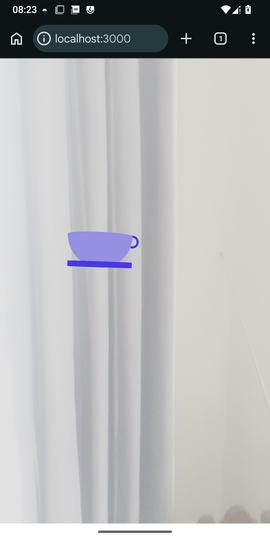

# RDK location-based tutorial - Part 3 - Using a real API with a database

In Part 3 we will further enhance our app by retrieving the points of interest from an actual, real database. For simplicity we will use [SQLite](https://sqlite.org) though note that a real-world AR app would probably use a geographically-aware database such [PostgreSQL](https://postgresql.org) with [PostGIS](https://postgis.org).

## Setting up the project

We will need to install extra dependencies, namely `better-sqlite3` and `@types/better-sqlite3`:

```console
npm i better-sqlite3 
npm i -D @types/better-sqlite3
```

## Populating our database

Use either the `sqlite3` command line tool or a GUI app such as [SQLite Studio](https://sqlitestudio.pl) to add a few points of interest to your database.
 
You can use this SQL:

```sql
CREATE TABLE pointsofinterest(
    id INTEGER PRIMARY KEY AUTOINCREMENT,
    name TEXT,
    type TEXT,
    lat REAL,
    lon REAL
);

INSERT INTO pointsofinterest (name, type, lat, lon) VALUES
 ('Village Cafe', 'cafe', 51.0505, -0.72),
 ("Tom's Cafe", 'cafe', 51.0506, -0.7205),
 ('Park', 'park', 51.0495, -0.72),
 ('The Red Lion', 'bar', 51.05, -0.721),
 ('Village Stores', 'shop', 51.05, -0.719)
```

Here is a modified version of our Express server which will deliver JSON containing the data from the database: 


```typescript
import express from 'express';
import ViteExpress from 'vite-express';
import BetterSqlite3 from 'better-sqlite3';

const PORT = 3000;

const app = express();

const db = new BetterSqlite3("pointsofinterest.db");

app.get('/map', (req, res) => {
    try {
        const stmt = db.prepare("SELECT * FROM pointsofinterest");
        const pois = stmt.all();
        res.send(pois);
    } catch(e) {
        res.status(500).json({error: "Error querying database"});
    }
});

ViteExpress.listen(app, PORT, () => {
    console.log(`Server running on port ${PORT}.`);
});
```

This is creating a prepared statement using the `better-sqlite3` API, retrieving all points of interest from the database. We then execute the prepared statement and send all the POIs back to the client as JSON.

### Making it more realistic with different "models" for different POI types

So far we're displaying "pushpin" markers for all points of interest. We can enhance the code to display different "models" depending on POI type. The components below are mockups of a teacup, a drinking glass with beverage, a tree (to represent a park) and a building (to represent a shop). They are not sophisticated but will do as a proof of concept.

As an alternative you can of course use pre-built 3D models such as those available at [Sketchfab](https://sketchfab.com), however loading models is out of scope for this tutorial and is left as an exercise for the reader.

#### Drinking glass

```tsx
export default function Glass() {
    return(
        <group scale={4}>
            <mesh position={[0, 1.5, 0]} >
                <cylinderGeometry args={[1, 1, 3]}/>
                <meshStandardMaterial color="#cc6600" transparent opacity={0.5} />
            </mesh>
            <mesh position={[0, 3.25, 0]}>
                <cylinderGeometry args={[1, 1, 0.5]} />
                <meshBasicMaterial color="white" />
            </mesh>
            <mesh position={[1, 2.5, 0]} rotation={[0, 0, -Math.PI*0.5]}>
                <torusGeometry args={[0.5, 0.1, 16, 100, Math.PI*1.2]} />
                <meshStandardMaterial color="gray" transparent opacity={0.2} metalness={0.1} />
            </mesh>
        </group>
    )
}
```

#### Teacup

```tsx
export default function Cup() {
    return(
        <group scale={2}>
            <mesh position={[0, 2.7, 0]} rotation={[0, 0,  Math.PI]}>
                <sphereGeometry args={[3, 32, 16, 0, Math.PI*2, 0, Math.PI /2]} />
                <meshBasicMaterial color="#8080ff" />
            </mesh>
             <mesh position={[0, 0, 0]}>
                <cylinderGeometry args={[3 ,3, 0.5]} />
                <meshBasicMaterial color="#4040ff" />
            </mesh>
            <mesh position={[3, 2.2, 0]} rotation={[0, 0, -Math.PI*0.6]}>
                <torusGeometry args={[0.5, 0.1, 16, 100, Math.PI*1.2]} />
                <meshBasicMaterial color="#4040ff" />
            </mesh>
        </group>
    )
}
```

#### Tree

```tsx
export default function Tree() {
    return(
        <group scale={4}>
            <mesh position={[0, 4, 0]}>
            <sphereGeometry args={[2.0]}/>
            <meshBasicMaterial color="green" />
            </mesh>
            <mesh position={[0, 1, 0]}>
            <cylinderGeometry args={[0.5, 0.5, 2]} />
             <meshBasicMaterial color="#aa5500" />
            </mesh>
        </group>
    )
}
```
#### Shop

The `Shop` is a bit more complex as we dynamically generate the windows for each face of the building. To this end we need to pass in the POI `id` as a prop, to ensure each window has a unique `key`.

```tsx
interface ShopProps {
    id: number;
}

export default function Shop({ id }: ShopProps ) {
    return (
        <group scale={4}>
            <mesh position={[0, 0.75, 0]}>
                <boxGeometry args={[1.5, 1.5, 1.5]} />
                <meshStandardMaterial color="#ff6060" />
                { [...Array(12)].map((_, idx) => (
                    <mesh key={`${id}:w${idx}`} position={[idx%2-0.5, Math.floor((idx%6)/2) * 0.4 - 0.4, Math.floor(idx/6)*1.5 -0.75]}>
                        <boxGeometry args={[0.3, 0.3, 0.1]} />
                        <meshStandardMaterial color="cyan" />
                    </mesh>
                ))}
                { [...Array(12)].map((_, idx) => (
                    <mesh key={`${id}:w${idx+12}`} position={[Math.floor(idx/6)*1.5 -0.75, Math.floor((idx%6)/2) *0.4 - 0.4, idx%2-0.5]}>
                        <boxGeometry args={[0.1, 0.3, 0.3]} />
                        <meshStandardMaterial color="cyan" />
                    </mesh>
                ))}
            </mesh>
            <mesh position={[0, 2, 0]} rotation={[0, Math.PI*0.25, 0]} >
                <coneGeometry args={[1, 1, 4]} />
                <meshStandardMaterial color="#803030" />
            </mesh>
             <mesh position={[0, 0.2, 1]}>
                <planeGeometry args={[0.2, 0.4]} />
                <meshStandardMaterial color="yellow" />
             </mesh>
        </group>
    );
}
```

Our `App` is now revised as follows:


```tsx
import { useEffect, useState } from 'react';
import { Canvas } from '@react-three/fiber';
import { GeolocationAnchor, GeolocationSession, XR } from '@omnidotdev/rdk';
import Tree from './basicModels/tree';
import Cup from './basicModels/cup';
import Glass from './basicModels/glass';
import Shop from './basicModels/shop';
import Marker from './basicModels/marker';
import Poi from './types/poi';

export default function App() {
    const [pois, setPois] = useState<Poi[]>([]);
   
    useEffect(() => {
        fetch('/map')
            .then(response => response.json())
            .then(json => setPois(json));
    }, []);

   
    const renderedPois = pois.map ( (poi) =>  {

        let poiComponent = <></>;
    
        switch(poi.type) {
            case "park":
                poiComponent = <Tree />;
                break;
            case "bar": 
                poiComponent = <Glass />;
                break;
            case "shop":
                poiComponent = <Shop id={poi.id} />;
                break;
            case "cafe":
                poiComponent = <Cup />;
                break;
            default:
                poiComponent = <Marker />;
        }
        
       
        return(
            <GeolocationAnchor key={poi.id} latitude={poi.lat} longitude={poi.lon}>
            {poiComponent}
            </GeolocationAnchor>
        );
    });    
        
    return(
        <Canvas gl={{antialias: false, powerPreference: "default"}}>
            <ambientLight intensity={3} />
            <directionalLight position={[0, 1, 0]} intensity={6} />
            <XR>
                <GeolocationSession options={{fakeLat: 51.0502, fakeLon: -0.7202}}>
                {renderedPois}
                </GeolocationSession>
            </XR>
        </Canvas>
    );
}
```

The logic now creates the appropriate component depending on the `type` property from the JSON. 

Try it out - you should now see the POIs loaded from the database and represented by "models" specific to the given POI type! 

Here is a screenshot on a real device, facing north:



### For you to try

Try adding a query string (use `req.query` to read) to your API endpoint, specifying a `bbox` (bounding box). This should take a comma-separated list of the west, south, east and north bounds of a geographical box. Modify the database query to find only points of interest within the bounding box.

Once you have finished go on to [Part 4](part4.md).
