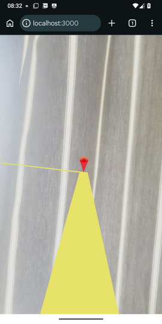

# RDK location-based tutorial - Part 4 - Rendering roads and paths 

In Part 4 we will enhance our app to render lines (e.g roads and paths) with RDK's `GeoLine` component.


## Populating our database

First, import some sample ways (roads or paths) into our simple SQLite database. Two tables `ways` (storing the ways themselves) and `way_points` (storing the individual points of each way) are created.

```sql
CREATE TABLE ways (id INTEGER PRIMARY KEY AUTOINCREMENT, type STRING);
CREATE TABLE way_points(id INTEGER PRIMARY KEY AUTOINCREMENT, wayid INTEGER, lat REAL, lon REAL, FOREIGN KEY(wayid) REFERENCES ways(id));
INSERT INTO ways (type) VALUES ('road'),('path'),('road');
INSERT INTO way_points(wayid, lat, lon) VALUES (1, 51.05, -0.72), (1, 51.0505, -0.72), (1, 51.051, -0.721); 
INSERT INTO way_points(wayid, lat, lon) VALUES (2, 51.05, -0.72), (2, 51.0495, -0.72);
INSERT INTO way_points(wayid, lat, lon) VALUES (3, 51.05, -0.719), (3, 51.05, -0.72), (3, 51.05, -0.721);

```

## Enhancing our server

First we will enhance our server so that it now serves ways as well as points. Some logic is required in the `map` endpoint to ensure that the JSON returned to the client contains an array of ways from the array of individual way points stored in the `way_points` table.

```typescript
import express from 'express';
import ViteExpress from 'vite-express';
import BetterSqlite3 from 'better-sqlite3';
import type Way from './types/way';
import type JsonWayPoint from './types/jsonWayPoint';

const PORT = 3000;

const app = express();

const db = new BetterSqlite3("pointsofinterest.db");

app.get('/map', (req, res) => {
    try {
        const stmt = db.prepare("SELECT * FROM pointsofinterest");
        const pois = stmt.all();
        const stmt2 = db.prepare("SELECT w.id, w.type, wp.lat, wp.lon FROM ways w INNER JOIN way_points wp ON w.id = wp.wayid ORDER BY w.id, wp.id");
        const wayPoints = stmt2.all() as JsonWayPoint[];
        const ways = new Array<Way>();
        wayPoints.forEach((wayPt, index) =>  {
            if(index == 0 || wayPoints[index].id != wayPoints[index-1].id) {
                ways.push({id: wayPt.id, type: wayPt.type, coordinates: [[wayPt.lon, wayPt.lat, 0]]});
            } else {
                ways[ways.length - 1].coordinates.push([wayPt.lon, wayPt.lat, 0]);
            }
        });
        res.send({pois, ways});
    } catch(e) {
        res.status(500).json({error: "Error querying database"});
    }
});

ViteExpress.listen(app, PORT, () => {
    console.log(`Server running on port ${PORT}.`);
});
```

This needs two types, `Way` (to represent a way as stored by the app) and `JsonWayPoint` (to represent a row in the `way_points` table). Save these in appropriate files in the `types` directory.

```typescript
export default interface Way {
    id: number;
    type: string;
    coordinates: [number, number, number?][];
}
```

```typescript
export default interface JsonWayPoint {
    id: number;
    lat: number;
    lon: number;
    type: string;
}
```

## Our front end

We now move to the front end. Our app is becoming larger now, so as a result we will separate out the rendering into a new `GeoDataRenderer` component.

First the `App` component:

```tsx
import { useEffect, useState } from 'react';
import { Canvas } from '@react-three/fiber';
import { GeolocationSession, XR } from '@omnidotdev/rdk';
import GeoDataRenderer from './GeoDataRenderer';
import type Way from '../types/way';

export default function App() {
    const [pois, setPois] = useState([]);
    const [ways, setWays] = useState<Way[]>([]);

    useEffect(() => {
        fetch('/map')
            .then(response => response.json())
            .then(json => {
                setPois(json.pois);
                setWays(json.ways);
            });
    }, []);


    return(
        <Canvas gl={{antialias: false, powerPreference: "default"}}>
            <ambientLight intensity={3} />
            <directionalLight position={[0, 1, 0]} intensity={6} />
            <XR>
                <GeolocationSession options={{fakeLat: 51.0502, fakeLon: -0.7202}}>
                    <GeoDataRenderer pois={pois} ways={ways} />
                </GeolocationSession>
            </XR>
        </Canvas>
    );
}
```

`App` is now simpler. It contains two state variables for `pois` and `ways`, and the effect that fetches the data from the server on startup sets those two state variables to the POI and way data returned from the server, respectively.

The JSX now just sets up the basic RDK template with most of the work done in `GeoDataRenderer`. The POIs and ways are passed into this component as props.

### GeoDataRenderer

So we will now look at the `GeoDataRenderer` component which actually renders the data.

```tsx

import { GeolocationAnchor, GeoLine } from "@omnidotdev/rdk";
import { useThree } from '@react-three/fiber';
import { useEffect } from 'react';
import Tree  from './basicModels/tree';
import Glass from './basicModels/glass';
import Cup from './basicModels/cup';
import Shop from './basicModels/shop';
import Marker from './basicModels/marker';
import type Poi from '../types/poi';
import type Way from '../types/way';

interface GeoDataRendererProps {
    pois: Poi[];
    ways: Way[];
}

export default function GeoDataRenderer({ pois, ways } : GeoDataRendererProps) {

     const { camera } = useThree();

     useEffect(() => {
        camera.position.setY(10)
     }, []);

     const renderedPois = pois.map ( (poi) =>  {

        let poiComponent = <></>;

        switch(poi.type) {
            case "park":
                poiComponent = <Tree />;
                break;
            case "bar":
                poiComponent = <Glass />;
                break;
            case "shop":
                poiComponent = <Shop id={poi.id} />;
                break;
            case "cafe":
                poiComponent = <Cup />;
                break;
            default:
                poiComponent = <Marker />;
        }


        return(
            <GeolocationAnchor key={`p${poi.id}`} latitude={poi.lat} longitude={poi.lon}>
            {poiComponent}
            </GeolocationAnchor>
        );
    });

    const renderedWays = ways.map ((way) => {
        return(
            <GeoLine coordinates={way.coordinates} key={`w${way.id}`} color='yellow' lineWidth={way.type == 'path' ? 2 : 5} />
        )
    });

    return <>{renderedPois}{renderedWays}</>;
}
```

Much of the logic is managing the POIs, as before. The new code involves rendering the ways. Thanks to RDK's `GeoLine` component, this is easy. We just need to map each `Way` to a `GeoLine` component, passing in the way's `coordinates` as well as an appropriate `color` and `lineWidth`. In this example we set the color to yellow. The line width (in Spherical Mercator units, approximately metres but dependent on your latitude) is wider (5) for roads and narrower (2) for paths.

**Note that if you use different colors for different `GeoLine`s, you might currently get flickering Z-fighting artefacts at the points at which they join. You can avoid this by ensuring the lines do not overlap.**

Also note this code:

```tsx
const { camera } = useThree();

useEffect(() => {
    camera.position.setY(10)
 }, []);
```

What is this doing? In order to view our scene more clearly, we need to elevate the camera slightly so it's looking down on our ways. In a real outdoors app you would probably elevate by around 2 metres but here we are elevating it by 10 metres to make it clearer to see if you are testing indoors. Note that inside a React Three Fiber `Canvas` component, you can obtain underlying three.js objects (e.g. the camera) via the `useThree()` hook.


Here is a screenshot on a real device, facing north (I have used a pushpin for the POI to improve the look of the screenshot).


